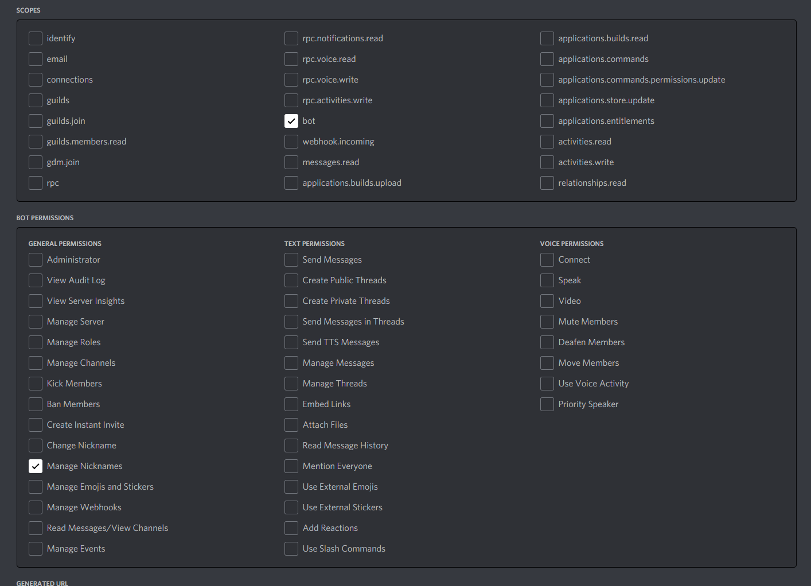

# CoinMarketCap Discord Bot

This is a discord bot that uses coinmarketcaps api to get the quoted price converted to usd for a coin.

### Setup
Go to the root of the project and type:
```bash
./gradlew.bat build
```
If on windows dont use ./

Once it is built you can navigate to build/libs, and you will see CoinMarketCapBot-1.0.jar

### Config

When you first run the bot it will create a app.config file. If you want to skip it automatically creating it place a file where the jar file is called app.config with the following:

```bash
COINMARKETCAP_API_KEY=
GUILD_ID=
COIN_TOKEN=
DISCORD_TOKEN=
```

### Installing JDK 8

#### Centos

```bash
yum -y update
```

```bash
yum install java-1.8.0-openjdk
```

#### Ubuntu

```bash
sudo apt-get update
```

```bash
sudo apt-get install openjdk-8-jdk
```

#### Mac

```bash
brew install --cask java8
```

#### Windows

```bash
https://www.oracle.com/java/technologies/javase/javase8u211-later-archive-downloads.html
```

### Running

```bash
java -jar CoinMarketCapBot-1.0.jar
```

### CoinMarketCap Api Setup
Go to https://coinmarketcap.com/api/ and click the button "GET YOUR API KEY NOW". It takes less than 5 min to setup.


### Discord Application Setup

Go to https://discord.com/developers/applications and click New Application. Once you have created a new application click into it if it does not navigate you to it. Then set the APP ICON. Next navigate to Bot and create a bot. Click the token reveal and copy it. You will be using this in the app.config.

Next navigate to the OAuth2



Copy the link and navigate to it. It will ask you to authorize the bot into the server.
